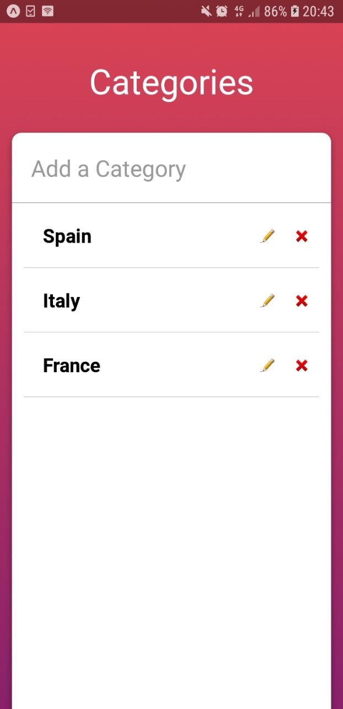
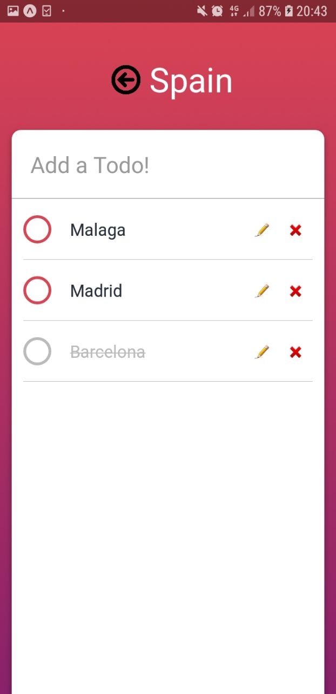

# saal

To-Do System

The goal is to create a system to manage To-Dos which includes the following functions:

● Add, remove or edit categories

● All data are serializable/storable (local storage)

Further information

● I am using react native, expo

● I have decided build it in this way because it is pretty simple app with efficient design.

